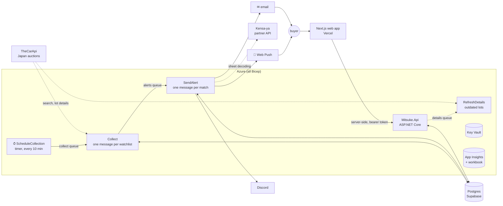

# Mitsuke 見つけ

[](https://github.com/QuasiInteractive/mitsuke/actions/workflows/ci.yml)

A 24/7 car watchlist for Australian and New Zealand buyers. Save the car you want ("R32 GT-R, grade 3.5+, under A$45,000 landed") and Mitsuke watches the Japanese auctions. Within minutes of a matching lot appearing it sends an email and a phone notification with the facts, which generation the car is, an estimated landed cost, whether it can legally be imported, a deal score and the auction sheet read into plain English.

**Live:** [mitsuke-jp.vercel.app](https://mitsuke-jp.vercel.app) · Sister product to [Kensa-ya](https://kensa-ya.vercel.app): *Mitsuke finds the car → Kensa-ya checks the car.*

**Stack:** C# / .NET 10 · Azure Functions (Flex Consumption) · Storage Queues · ASP.NET Core minimal API · PostgreSQL (Supabase) · Next.js 16 · Bicep · GitHub Actions (OIDC) · OpenTelemetry → Application Insights · Polly · xUnit + Testcontainers

## Architecture



Each message gets five attempts. A failed alert then moves to `alerts-poison` for inspection, because it's a promise to tell someone about a car. A failed or stale collect message is simply dropped, because the next run ten minutes later does the same work. The CLI (`dotnet run -- scan`) runs the same `Collector` and `AlertSender` in-process, so local runs and the cloud share one code path.

### Decisions worth reading

- **At-least-once queues, exactly-once alerts.** Storage queues can redeliver, so every stage is safe to repeat. Collecting is upserts. Sending claims `(watchlist, listing, channel)` in Postgres with `INSERT … ON CONFLICT` before anything goes out, then marks the claim sent or failed. A claim left `pending` by a crashed sender expires after 10 minutes. Because each channel is claimed separately, a failed push is retried without re-sending the email. Tested end to end against a real Postgres.
- **Resilience on every external call.** Each HTTP client runs a Polly pipeline: total timeout → jittered retry (honours `Retry-After`) → circuit breaker → client-side rate limiter → per-attempt timeout. A Kensa-ya outage downgrades the alert ("sheet not yet decoded") instead of blocking it.
- **Polite to the data provider by design.** A hard page cap per search and a sliding-window limiter mean a bad filter can never turn into a bulk crawl of a live API key. Lot details and sheet reads cost money or quota, so they're fetched only for alerts actually going out, and cached.
- **Swappable sources.** Every provider implements `IListingSource` and emits one normalised `Listing`. Adding Trade Me or an alert-email inbox touches one project.
- **One engine, two products.** Landed cost is Kensa-ya's engine, vendored unchanged by [`sync-kensaya-engine.sh`](scripts/sync-kensaya-engine.sh). [`LandedCostParityTests`](tests/Mitsuke.Tests/LandedCostParityTests.cs) replays 160 of Kensa-ya's golden cases and fails the build if Mitsuke would quote a different number, to the cent. Sheet reading is Kensa-ya's paid product, so it is *called* over a partner API (bearer key, SSRF host allowlist), never copied.
- **Rules shared word for word.** Import eligibility (Australia's 25-year rule and SEVS register, NZ and US rules) is Kensa-ya's engine too, vendored by the same script with only one enum restated so none of Kensa-ya's sheet code comes along. [`EligibilityParityTests`](tests/Mitsuke.Tests/EligibilityParityTests.cs) replays all 450 of Kensa-ya's eligibility cases and compares every reason buyers read, character for character. It uses the build month when the feed has one, and assumes December when it doesn't, so it never calls a car eligible early.
- **Data quirks found in production, fixed at the edge.** TheCarApi's model filter is exact, and it files the same Evo under "Lancer" and "Lancer Evolution": one live watchlist saw 1 car while 4 more were invisible. The fix lives in the adapter (it searches every name in an observed alias group and yields each lot once), and a matching chassis code now outranks the feed's model name. The per-run "why didn't it match" log line is what exposed it.
- **Saying what we know, and how we know it.** One chassis code can span generations (CT9A is the Evo VII, VIII and IX). [`ModelVariants`](src/Mitsuke.Core/ModelVariants.cs) narrows it by build date, then by gearbox: a 6-speed on the sheet rules out the VII. It says "Likely Evo VIII" when it rests on machine-read data and "VII or VIII" rather than guess. Spec read from the sheet by OCR is marked unless the provider cross-checked it.
- **Old records catch up without hammering the provider.** Saved lot details carry a format number. When a lot page finds an older one, the API puts a message on a `details` queue and renders what it has; the pipeline, the only place with the provider key, rate limiter and retries, fetches it once. Page views never call TheCarApi, and a car is refetched once per format, not once per view.
- **Our own price history.** TheCarApi has no Japanese sale prices, so Mitsuke logs every price change and links relisted cars to one `vehicle` by frame number. The deal score ranks a lot against comparable cars (same model code, similar year, km and grade), counting each physical car once and never the car itself. It reports how many cars it used and how confident it is, and says nothing rather than guess when there are fewer than five.
- **Auth the boring, correct way.** Supabase Auth magic links; Mitsuke stores no passwords. The API validates ES256 tokens with stock JWT bearer auth, discovering the signing keys from the issuer, so there's no shared secret and key rotation needs no deploy. Tests prove that forged, mis-issued, wrong-audience and expired tokens get a 401, and that one person can't read or change another's watchlists or devices.
- **Private by default.** The production tables live in a schema that Supabase's auto-generated REST API doesn't expose. Azure resources reach storage, queues and Key Vault through a managed identity, with no account keys anywhere. Secrets are Key Vault references, so the values never appear in app settings.
- **Honest data.** Japanese prices are opening bids, never sale prices, and the type system (`PriceKind`) carries that through to the alert text. Unknown values fail any filter that needs them, so Mitsuke never alerts on a guess. Every alert names its source and carries a disclaimer.

What the data actually contains was checked against the live API before the schema was designed: [docs/thecarapi-findings.md](docs/thecarapi-findings.md).

## Operations

### Deploys

Every push to `main` runs build, all tests (including Postgres integration tests) and web lint/build. Only if those pass does it migrate the database (schema first, so new code never meets an old database), deploy the API and the pipeline, and smoke-test both health endpoints. GitHub signs in to Azure with **OIDC**: a deploy identity trusted only for this repo's `production` environment, allowed to deploy to one resource group and to read one Key Vault. No Azure credentials are stored anywhere. The web app deploys through Vercel's Git integration.

Infrastructure is [`infra/main.bicep`](infra/main.bicep), applied by [`deploy-infra.sh`](scripts/deploy-infra.sh) with a `what-if` preview first.

### Observability

OpenTelemetry from both apps to Application Insights: requests, outbound dependencies (TheCarApi, Kensa-ya, exchange rates, push services), exceptions and structured logs. The ops dashboard is an Azure Monitor workbook **defined in Bicep** ([`infra/workbook.json`](infra/workbook.json)). Its queries are generated by [`scripts/workbook.py`](scripts/workbook.py), and `--validate` runs every one of them against the live workspace before they ship. It shows:

- function runs succeeded vs failed, and resilience events (timeouts, retries, circuit breaks)
- outbound call volume, failure rate and p95 latency per dependency
- for each watchlist: its latest run, how many lots were on auction, and **why each one didn't match** ("model code BL32 ×1, landed A$46,420 > A$35,000 ×1"), so "why didn't I get an alert?" is answered from the logs
- alerts by channel, API routes, exceptions, and billable ingestion against the daily cap

**Telemetry has a budget.** Log Analytics has a 100 MB/day cap. On day one, per-minute connection-pool and GC gauges made up about 70% of ingestion, so both apps now drop them through shared OpenTelemetry views ([`MitsukeTelemetry.cs`](src/Shared/MitsukeTelemetry.cs)), and the Functions host's startup dumps are logged only at Warning. The same file strips device tokens from Web Push endpoint URLs before they reach a trace. URL query strings are redacted, and API keys travel in headers, never URLs.

**Incident, 7 Oct 2026, 21:40–22:05 UTC.** TheCarApi stopped responding. Searches hit the 20 s attempt timeout, retries ran out and the circuit breaker opened, so calls failed fast instead of piling up. Three scheduled runs failed: each watchlist's message was tried five times, then parked in `collect-poison`. The 22:10 run, scheduled as normal, found every lot again. No alert was lost or duplicated, because collecting is stateless (each run re-reads the market) and the claim log makes resending safe. Lots also appear days before their auction. Nobody had to step in. The dashboard shows it as a spike of resilience events next to 45 failed `Collect` attempts.

The follow-up came from those parked messages: they were work the next run had already redone, so they were noise in a queue meant for things that need a human. Collect messages now carry their schedule time and are dropped once a newer run has replaced them, and a collect that fails its last attempt is logged as an error and completed. `alerts-poison` is unchanged.

### Cost

Built to run in free tiers: Functions Flex Consumption (free grant), App Service F1, Storage, Key Vault, Log Analytics under its free allowance, Supabase free, Vercel hobby. Month-to-date spend for the whole resource group is under A$0.01, and an A$10 budget alert watches it. The things that could cost money are capped in code: at most 40 pipeline instances, a daily log cap, and paid sheet reads only for alerts actually going out, cached per car.

## What it does

| Feature | Notes |
|---|---|
| Watch Japanese auctions 24/7 | TheCarApi adapter; every 10 minutes per active watchlist |
| Watchlists | Make, model, chassis codes, years, km, minimum grade, repaired or not, landed budget in A$ or NZ$; JDM presets |
| Landed cost AU/NZ | Kensa-ya's engine with live exchange rates: car, auction and export fees, shipping, duty, GST, compliance |
| Import eligibility | Can it legally be imported, and how: 25-year rule, SEVS register, personal import; official links and the rules' last-checked date. On every alert and lot page |
| Which car exactly | Generation from chassis code, build month and gearbox ("Likely Lancer Evolution VIII"), plus colour, engine, gearbox, first registration, doors, seats, air con |
| Deal score | Percentile against comparable cars, with confidence; seeded from TheCarApi's archive by `backfill` |
| Auction sheet in plain English | Kensa-ya partner API; serious red flags (e.g. doubtful mileage) lead the alert |
| Alerts | HTML email (every value HTML-encoded) and Web Push (VAPID, payload encrypted per device, dead devices pruned on 404/410); Discord for demo lists |
| Web app | Matches, lot page (gallery, sheet faults on a car diagram, cost breakdown, import check, relist history, countdown), "Not for me" / "Keep watching" / "Request a bid"; watchlists you can edit in place; installable PWA |
| Bid hand-off | Mitsuke never bids or holds money: a validated, rate-limited bid request goes to a partner exporter. Until one is signed, the button says it's a request, not a promise (`NEXT_PUBLIC_BID_PARTNER_LIVE`) |

## Projects

| Project | Purpose |
|---|---|
| `src/Mitsuke.Core` | Domain and pipeline: `Listing`, `Watchlist`, `WatchlistMatcher`, `Collector`, `AlertSender`, deal score, formatters, interfaces. No infrastructure dependencies. |
| `src/Mitsuke.Sources.TheCarApi` | TheCarApi adapter: typed `HttpClient`, resilience pipeline, JSON → `Listing` mapping. |
| `src/Mitsuke.Pricing` | Landed cost and import eligibility: Kensa-ya's engines and country rules (`Kensaya/`, `data/`, synced, never edited) behind `ILandedCostEstimator` and `IEligibilityChecker`, with live exchange rates. |
| `src/Mitsuke.Data` | Postgres via Npgsql and Dapper. Forward-only SQL [migrations](src/Mitsuke.Data/Migrations), applied under an advisory lock. |
| `src/Mitsuke.Kensaya` | Client for Kensa-ya's partner API (sheet decoding), with its own resilience pipeline. |
| `src/Mitsuke.Notifications` | Channels: Discord/console (`INotifier`), SMTP email (`IEmailSender`), Web Push (`IPushSender`). |
| `src/Mitsuke.Functions` | Azure Functions (isolated worker, .NET 10): the timer, the collect and alert stages, the details refresh, `GET /api/health`. |
| `src/Mitsuke.Api` | Minimal API for the web app: lot views, matches, `/api/me` (watchlists, feedback, devices), bid requests. OpenAPI at `/openapi/v1.json` in development. |
| `src/Shared` | Telemetry rules compiled into both apps. |
| `src/Mitsuke.Cli` | Local runner: `migrate`, `seed`, `scan`, `backfill`, `test-email`. |
| `web/` | Next.js 16 (React 19, Tailwind 4, Cache Components / partial prerendering). Calls the API from its server only. |
| `tests/Mitsuke.Tests` | xUnit: unit tests, plus integration tests against real Postgres (Testcontainers) and the real API host (`WebApplicationFactory`). Hand-written fixtures only, because the provider's terms forbid redistributing raw feeds. |

## Run it

Needs the .NET 10 SDK and Docker.

```bash
cp .env.example .env     # then fill in the TheCarApi key and a local database password
docker compose up -d     # Postgres 17 on localhost:5432
dotnet test              # unit + integration tests (starts its own throwaway Postgres)

dotnet run --project src/Mitsuke.Cli -- migrate
dotnet run --project src/Mitsuke.Cli -- seed
dotnet run --project src/Mitsuke.Cli -- backfill  # one-off: past lots for the deal score
dotnet run --project src/Mitsuke.Cli -- scan      # run it twice: the second pass sends nothing new
```

Set `DISCORD_WEBHOOK_URL` in `.env` to get alerts in Discord instead of the console. For push, put a VAPID key pair in `.env` (see `.env.example`) and the public half in `web/.env.local`, then use "Turn on" on the Watchlists page.

### Run the web app

```bash
npx supabase start                                                   # local Supabase Auth (ports 643xx); emails land in Mailpit at :64324
dotnet run --project src/Mitsuke.Api --urls http://localhost:5107   # the API (reads .env; set SUPABASE_URL=http://127.0.0.1:64321)
cd web && cp .env.example .env.local && npm install && npm run dev  # http://localhost:3001 (publishable key from `npx supabase status`)
```

Supabase's default ports (543xx) collide with Windows' reserved port ranges, hence 643xx in `supabase/config.toml`. Alerts link to their lot page when `MITSUKE_WEB_URL` is set in `.env`.

### Run it 24/7 locally (Azure Functions + Azurite)

Needs [Azure Functions Core Tools](https://learn.microsoft.com/azure/azure-functions/functions-run-local) v4.

```bash
docker compose up -d                          # Postgres + Azurite (local Azure Storage)
python scripts/local-settings.py              # writes the gitignored local.settings.json from .env
cd src/Mitsuke.Functions && func start --port 7073
```

`python scripts/local-settings.py --schedule "0 */1 * * * *"` runs the collection every minute instead of every ten, to watch it work.

## Rules this project keeps

- No scraping of sites that forbid it, no fake accounts, no stored third-party passwords.
- Secrets only in environment variables locally and Key Vault in Azure. Never in code or git.
- Show analysed results, never raw feeds. Attribute every listing to its source. Every alert says it's an estimate.
